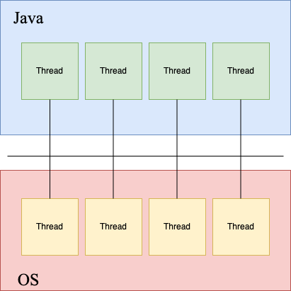
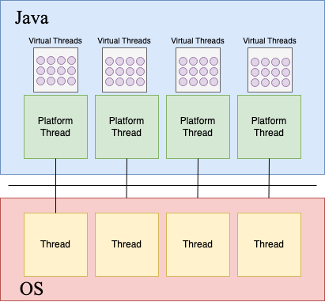
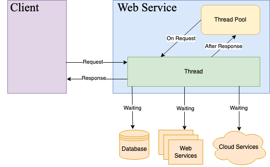

# Java Virtual Threading Examples 

This repository was built to support a [talk that I am doing on Java 21 and virtual threads](https://docs.google.com/presentation/d/1hzSnyir5_3TAXnjFKGC_1KGoWiSzZ92qM6NpAWgm_l8/edit#slide=id.p).

## Traditional Java Threads

## What is a virtual thread?

## Server Applications

## Cpu Intensive Experiment

## Blocking Task Experiment

## Http Client/Server Experiment

